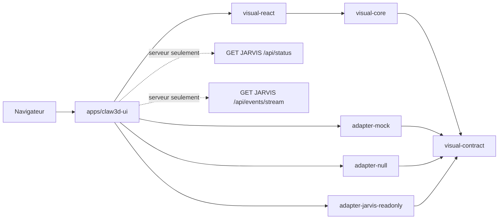

# Architecture de l'UI visuelle

## Frontière du produit

Claw3D est un produit visuel autonome. Son core ne pilote aucun agent, n'exécute aucune commande métier et ne dépend d'aucun checkout JARVIS. La scène historique, ses modèles GLB CC0, ses animations, sa navigation et le builder Phaser sont conservés.



Règles de dépendance:

- `visual-contract`: modèles neutres, ports, schémas et fixtures v1;
- `visual-core`: reducers, déduplication, navigation, géométrie, états d'animation et view-models, sans I/O;
- `visual-react`: composants React/Three/Phaser pilotés par props et callbacks;
- `adapter-mock` et `adapter-null`: données déterministes ou état hors ligne, sans backend;
- `adapter-jarvis-readonly`: validation des DTO synthétiques et couche anti-corruption;
- `apps/claw3d-ui`: sélection explicite de l'adaptateur, routes Next.js same-origin et connecteur serveur allowlisté.

Sont interdits dans `visual-core` et `visual-react`: `fetch`, `WebSocket`, `EventSource`, `process.env`, `next/server`, `node:*`, `fs`, `/api/`, OpenClaw, Hermes et JARVIS. La CI exécute `scripts/verify-visual-boundaries.mjs` pour faire respecter cette frontière.

## Flux JARVIS neutralisé

```text
Navigateur
  -> GET /api/visual-runtime/v1/{meta,snapshot,events,auth/status}
  -> connecteur serveur Claw3D
  -> allowlist exacte JARVIS: GET /api/status, GET /api/events/stream
```

Le connecteur supprime prompts, messages, réponses, arguments/résultats d'outils, chemins, secrets, mémoire et champs non allowlistés avant émission. Les événements inconnus sont ignorés. Le core gère `event_id`, l'ordre, les doublons, les événements anciens, `Last-Event-ID`, `stream.reset`, les trous de flux et la reconnexion bornée avec jitter.

Les erreurs 401, 403, 429 et 5xx deviennent des états visuels neutres. Aucune route de commande métier n'est exposée. Les capacités masquent toute action non supportée.

## Authentification

`session-auth` est désactivé. JARVIS utilise une frontière de cookie qui ne peut pas être relayée entre origines sans affaiblissement; Claw3D ne copie donc aucun `Set-Cookie`, `Domain`, `Path`, `SameSite`, `Secure` ou secret. L'état d'authentification same-origin indique explicitement que la capacité est indisponible.

## Assets et stockage

- Les 17 modèles GLB conservés correspondent byte à byte au Furniture Kit 1.0 de Kenney, licence CC0.
- Les assets sont résolus par `AssetResolver`; le core ne contient aucun chemin HTTP absolu.
- Les préférences passent par `StoragePort` et utilisent un namespace neutre versionné.
- La persistance navigateur est désactivée par défaut et peut être effacée depuis l'UI.
- Les builds, caches, logs, PID, temporaires et données de test restent dans la racine du dépôt.

## Arrêt immédiat

Le kill switch ne demande aucune modification de JARVIS:

```dotenv
JARVIS_CONNECTOR_ENABLED=false
VISUAL_ADAPTER=null
```

Après `scripts/stop.sh` puis `scripts/start.sh`, aucune requête JARVIS n'est permise. Supprimer ou déplacer Claw3D ne change aucun fichier, service, route ou health-check JARVIS.
