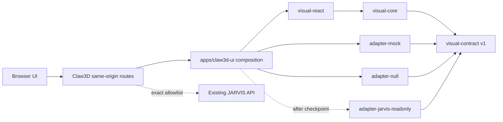

# Visual UI architecture

Claw3D owns the visual surface and its narrow server connector. JARVIS owns no
Claw3D code and has no dependency on this repository.



Allowed source dependency direction:

```text
visual-react -> visual-core -> visual-contract
adapter-* -------------------> visual-contract
apps/claw3d-ui -> visual-react + selected adapter
```

`visual-core` contains reducers, navigation, geometry, stale-event protection,
deduplication and view-models. `visual-react` contains controlled React, React
Three Fiber/Drei and Phaser components. Neither package knows a backend name,
route, cookie, environment variable, server framework, filesystem, or transport.

The composition package is the only adapter selector. Missing or invalid runtime
configuration selects `null`. An explicit `jarvis-readonly` request also selects
`null` unless `JARVIS_CONNECTOR_ENABLED=true` exactly. The private read-only
connector is deliberately deferred until checkpoint approval; it will translate
only allowlisted data into `visual-contract` values.

Browser storage is injected through `StoragePort`, disabled by default, namespaced
under `claw3d.visual.v1.`, and erasable from the UI. Visual assets are injected
through `AssetResolver`; the checkpoint scene uses code-native geometry and no
unverified GLB or vendored avatar asset.
